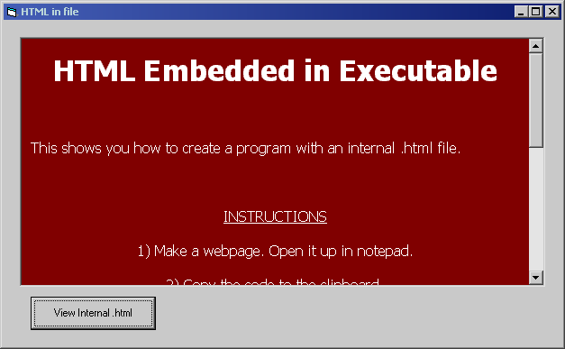



## EASY HTML EMBEDDED IN \.EXE

### Description

Really easy code and simple way of using an embedded .html file in a .exe. The code for the .html is stored in multiple strings, which are loaded and combined, then saved to a temp folder. Then the webbrowser opens the temp file for viewing. When program unloads the temp file is deleted. Please vote if you like it! Thanks.
 
### More Info
 

             |
---                |---
**Submitted On**   |2001-06-17 01:38:20
**By**             |[Armen Shimoon](https://github.com/Planet-Source-Code/PSCIndex/blob/master/ByAuthor/armen-shimoon.md)
**Level**          |Beginner
**User Rating**    |4.9 (34 globes from 7 users)
**Compatibility**  |VB 6\.0
**Category**       |[Miscellaneous](https://github.com/Planet-Source-Code/PSCIndex/blob/master/ByCategory/miscellaneous__1-1.md)
**World**          |[Visual Basic](https://github.com/Planet-Source-Code/PSCIndex/blob/master/ByWorld/visual-basic.md)
**Archive File**   |[EASY HTML 212546172001\.zip](https://github.com/Planet-Source-Code/armen-shimoon-easy-html-embedded-in-exe__1-24158/archive/master.zip)

